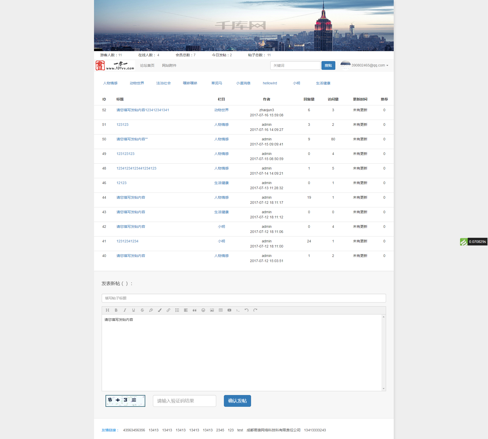
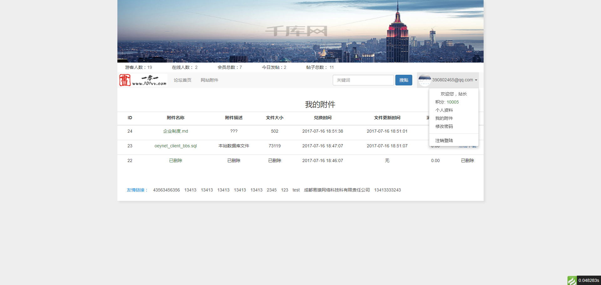
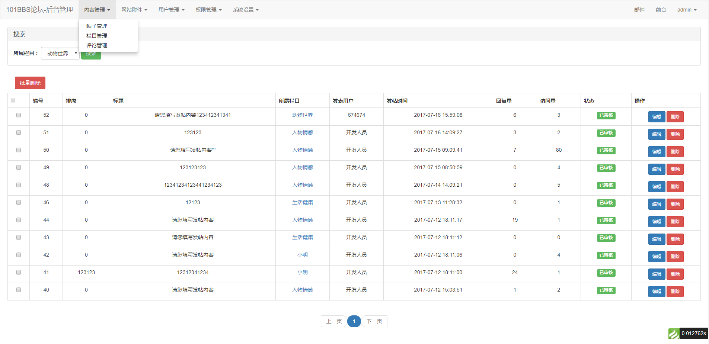
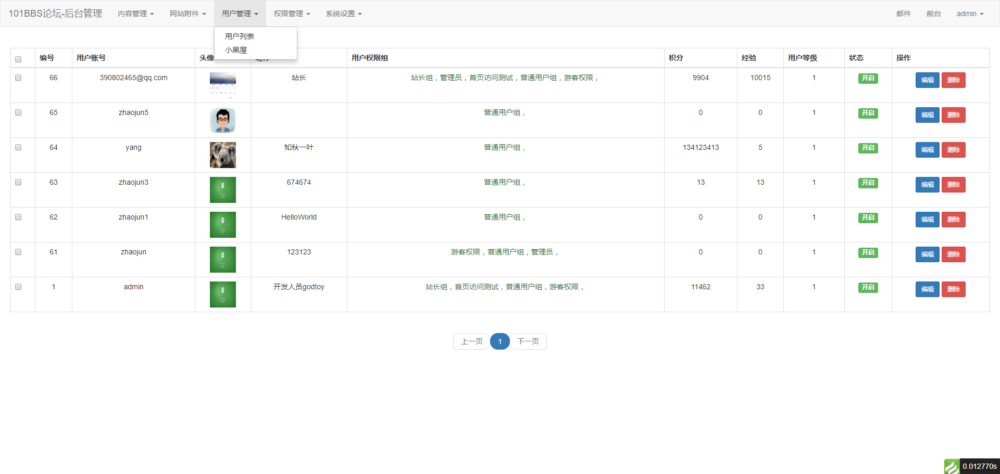
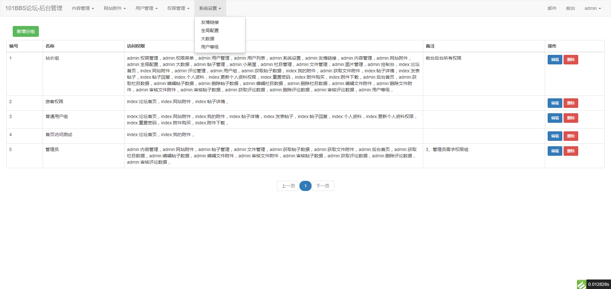
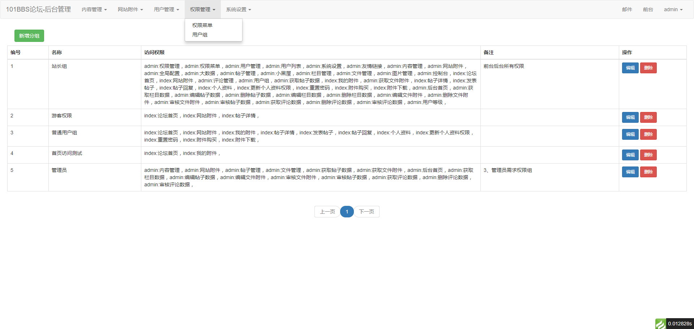

>最近有个朋友有个小需求，刚好有时间，也刚好准备研究一下tp5，听说tp5规范了，而且更傻瓜化了。
>便做了这个论坛的小Demo，开源出来玩玩，改天做两个模版。说句实话，TP5模型层，数据库层真的很好用

## Env Docker
docker大家肯定已经熟悉不过了

环境： Redis3.1+PHP5.6-fpm+Nginx+Mysql5.7

## 项目地址
https://github.com/zhaojunlike/php-simple-bbs
## Usage
1.git clone https://github.com/zhaojunlike/php-simple-bbs.git client101vbbs

2.docker-compose up --build -d

## 第一次需要手动导入测试数据

导入默认的测试数据
```shell
$  docker network ls
$  docker run -it --link mysql-db:mysql --network client101vbbs_default -v `pwd`/data/backup:/data/backup:ro --rm mysql:5.7 sh -c 'exec mysql -h"mysql" -P"3306" -uroot -p"zhaojun" oeynet_client_bbs<./data/backup/oeynet_client_bbs.sql'
```

## Docker Containers
- composer 临时容器，安装composer包
- bower 临时容器，安装前端包、

下面就是nmp环境而已了
- nginx 
- php-fpm
- mysql-db
- redis

## Tp5踩过的坑
- 1.模型关联
- 2.模型验证,控制器验证
- 3.动态属性
- 4.view层大小写（以为控制器对应视图层大小写都规范，最后view全部都换小写了，不然会在linux部署报错）

## Demo演示

## Screenshots


#### 首页

#### 首页我的附件

#### 内容管理

#### 用户管理和小黑屋

#### 系统统计和配置

#### RBAC权限用户组



